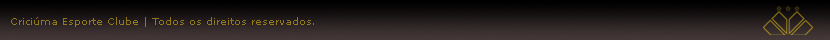
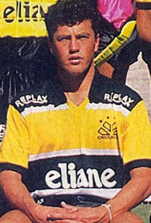
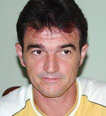

<!DOCTYPE html>
<html lang="en">
<head>
    <meta charset="UTF-8">
    <meta name="viewport" content="width=device-width, initial-scale=1.0">
    <title>Document</title>
    <link rel="stylesheet" href="Principal.css">
</head>
<body>
    

   <a href="Historia.html">História </a>  | <a href="Jogadores.html"> Jogadores</a>

 

</body>
</html>

<!DOCTYPE html>
<html lang="en">
<head>
    <meta charset="UTF-8">
    <meta name="viewport" content="width=device-width, initial-scale=1.0">
    <title>Document</title>
    <link rel="stylesheet" href="Principal.css">
</head>
<body>
    

    <a href="Historia.html">História </a>  | <a href="Jogadores.html"> Jogadores</a>  | <a href="Principal.html">Principal</a> 

 

-<a href="JairoLenzi.html"> Jairo Lenzi</a>
  
-<a href="RobertoCavalo.html"> Roberto Cavalo</a>
  
-<a href="Itá.html"> Itá   </a>
  
   
<strong> Roberto Cavalo</strong>
   
   

   
   
Roberto Fernando Schneiger, ou simplesmente Roberto Cavalo, (Carazinho, 13 de abril de 1963) é um ex-futebolista brasileiro que atuava 
como volante e tornou-se treinador de futebol em 1997. Roberto Cavalo era um jogador que tinha como principais qualidades o bom poder
 de marcação e os chutes de fora área. Também era um exímio cobrador de faltas.
   
   
<strong>Jogador</strong>
   
   
Roberto Cavalo era volante. Jogou no Atlético Paranaense, Criciúma, Vitória e Botafogo, clube onde foi vice-campeão da Recopa Sul-americana
 em 1994.
   
   
Como jogador, Roberto Cavalo atuou também no América de Rio Preto e no Bahia. Ele brilhou no Vitória, equipe na qual foi vice-campeão
 brasileiro de 93 (perdeu para o Palmeiras na final). Também conquistou o título de Campeão da Copa do Brasil, em 1991, pelo Criciúma, 
 tornando-se até hoje ídolo daquela torcida.
   
   
<strong>Treinador</strong>
   
   
Roberto Cavalo decidiu por ser treinador em 1997. Trabalhou no Avaí, onde foi campeão da Série C e campeão catarinense. Já em 2004, 
fez brilhante campanha na Campeonato Brasileiro da Série B tendo sido um dos quatro finalistas (terminou num honroso terceiro lugar).
   
   
Em 2007 assumiu o Gama, levando-o às oitavas-de-final da Copa do Brasil. Em meio a uma crise, deixa o Gama em setembro do mesmo ano 
para assumir o Criciúma sendo no começo do ano de 2008 técnico do América de Natal. No dia 25 de maio retornou ao Gama permanecendo
 por dois meses no clube, pedindo demissão ao não chegar a um acordo com a diretoria para um aumento salarial. Ainda em 2008 assumiu
  o Bahia, em substituição ao técnico Arturzinho que foi demitido anteriormente. e estava dirigindo Associação Desportiva Confiança
   de Sergipe.
   
   
No dia 11 de setembro de 2009, foi anunciado como novo comandante do Paraná Clube no dia 18 de dezembro de 2009, foi anunciado como
 novo técnico do Mixto Esporte Clube para o ano de 2010.treinou o Vila Nova, do estado de Goiás, disputando Campeonato Brasileiro da 
 Série B. Novamente Cavalo voltou ao Paraná Clube substituindo Marcelo Oliveira. Em 2011 treina o Vila Nova e faz péssima campanha 
 derrubando o time para o Campeonato Brasileiro da Série C e consequentemente é demitido. Em 2012 assumiu o Oeste.
   
      

</body>
</html>

<!DOCTYPE html>
<html lang="en">
<head>
    <meta charset="UTF-8">
    <meta name="viewport" content="width=device-width, initial-scale=1.0">
    <title>Document</title>
    <link rel="stylesheet" href="Principal.css">
</head>
 
    

   <a href="Historia.html">História </a>  | <a href="Jogadores.html"> Jogadores</a>  | <a href="Principal.html">Principal</a> 

 

-<a href="JairoLenzi.html"> Jairo Lenzi</a>
  
-<a href="RobertoCavalo.html"> Roberto Cavalo</a>
  
-<a href="Itá.html"> Itá   </a>
  
   
   
</body>
</html>

<!DOCTYPE html>
<html lang="en">
<head>
    <meta charset="UTF-8">
    <meta name="viewport" content="width=device-width, initial-scale=1.0">
    <title>Document</title>
    <link rel="stylesheet" href="Principal.css">
</head>
<body>
    

    <a href="Historia.html">História </a>  | <a href="Jogadores.html"> Jogadores</a>  | <a href="Principal.html">Principal</a> 

 

-<a href="JairoLenzi.html"> Jairo Lenzi</a>
  
-<a href="RobertoCavalo.html"> Roberto Cavalo</a>
  
-<a href="Itá.html"> Itá   </a>
  
   

<strong> Jairo Lenzi</strong>
   
   

   
   
Jairo Jair Lenzi, mais conhecido como Jairo Lenzi (Barra Velha, 22 de junho de 1968), é um ex-futebolista brasileiro que atuava como Ponta-esquerda. Índice
   
   
<strong>Carreira</strong>
   
   
Driblador, veloz e com um "chute venenoso", Jairo Lenzi começou em 1985, no Marcílio Dias, e quatro anos depois foi levado ao Criciúma por Levir Culpi. Devido
 às boas atuações na campanha do Criciúma na Libertadores de 1992, o técnico da seleção brasileira, Carlos Alberto Parreira, chegou a cogitar convocar o ponta 
 em maio daquele ano, mas ele acabaria nunca tendo uma chance com a camisa amarela. Finda a participação na Libertadores, foi emprestado ao Grêmio e, em seguida, 
 ao Internacional, mas não foi bem em nenhum dos dois clubes e voltou ao Criciúma antes do Campeonato Brasileiro de 1993.
   
     
 
</body>
</html>

<!DOCTYPE html>
<html lang="en">
<head>
    <meta charset="UTF-8">
    <meta name="viewport" content="width=device-width, initial-scale=1.0">
    <title>Document</title>
    <link rel="stylesheet" href="Principal.css">
</head>
<body>
    

    <a href="Historia.html">História </a>  | <a href="Jogadores.html"> Jogadores</a>  | <a href="Principal.html">Principal</a> 

 

-<a href="JairoLenzi.html"> Jairo Lenzi</a>
  
-<a href="RobertoCavalo.html"> Roberto Cavalo</a>
  
-<a href="Itá.html"> Itá   </a>
  
   
   
  
   
<strong>Itá</strong>
  
   

  
   
Antônio Luiz Sartoretto, mais conhecido como Itá (Itá, 14 de abril de 1962) é um ex-futebolista brasileiro. Era lateral esquerdo.
  
  
<strong> Jogador</strong>
  
  
Começou a sua carreira nas categorias de base da Chapecoense em 1983 aos 21 anos de idade. Transferiu-se para o Criciúma em 1989, aonde conquistou 5 títulos estaduais e a Copa do Brasil de 1991. Em 1997 foi para o Avaí aonde se transformou rápido num dos ídolos e líderes do time e conquistou o título estadual de 1997. Em 1998 anunciou o fim de sua carreira no próprio Avaí e assumiu um cargo de dirigente de marketing dentro do clube. No final do ano, voltou a traz e atuou no Fraiburgo. Logo após encerrou sua carreira de jogador de fato. Em 1999 assumiu o cargo de gerente de futebol do Criciúma.
  
  
<strong>Técnico</strong> 
  
  
Em 1999, voltou a atuar como jogador no Fraiburgo mas também assumiu a função de treinador do time. Em 2001 assumiu o Caxias de Joinville, desta vez somente como técnico.[4]
  
  
</body>
</html>

<!DOCTYPE html>
<html lang="en">
<head>
    <meta charset="UTF-8">
    <meta name="viewport" content="width=device-width, initial-scale=1.0">
    <title>Document</title>
    <link rel="stylesheet" href="Principal.css">
</head>
<body>
    

   <a href="Historia.html">História </a>  | <a href="Jogadores.html"> Jogadores</a>  | <a href="Principal.html">Principal</a> 

   
   
   <strong> O Clube</strong>
 
 
<strong>  Comerciário Esporte Clube</strong>
 
 
   O Comerciário Esporte Clube foi fundado em 13 de maio de 1947, na Praça Nereu Ramos, por um grupo de rapazes, na maioria com 18 anos, moradores do centro da cidade. Esta foi a primeira vez que o centro possuía um time de futebol.
 
 
   No dia 15 de maio, do mesmo ano, aconteceu a primeira partida do recém fundado clube. O adversário foi o já tradicional São Paulo Futebol Clube, da Vila Operária. O jogo aconteceu no estádio do Ouro Preto e o placar não poderia ter sido outro, a jovem equipe foi derrotada por 4 a 0.
 
 
   A primeira bola do time foi comprada por 17 contos e 500 réis e o primeiro terno, listrado de azul e branco, adquirido após uma coleta no comércio. No dia 8 de junho, as duas equipes voltaram a se defrontar no mesmo local. O time do São Paulo voltou a aplicar outra goleada, 4 a 1, sendo que o zagueiro, Carlitos, foi o autor do primeiro gol do time do centro.
 
 
   A primeira vitória só aconteceu na terceira partida, também diante do São Paulo, o Comerciário venceu pelo placar foi 3 a 2. A primeira viagem foi para Siderópolis, onde o time enfrentou o Grêmio Esportivo Macedo Soares. A equipe de Criciúma conquistou um honroso empate fora de casa.
 
 
   O primeiro título do Comerciário foi conquistado em Siderópolis, em 8 de fevereiro de 1948. O time era considerado a zebra do torneio, por ser o caçula da região. Em 1949 aconteceu a primeira grande vitória do time do centro, a equipe azul e branca derrotou o Atlético Operário em duas oportunidades, por 3 a 1 e 6 a 1, conquistando assim o seu primeiro título da Larm (Liga Atlética da Região Mineira). O esquadrão campeão era formado por: Mário; Colombi, Vante, Muricy e Zoile; Ary, Carlitos e Eraldo; Detefon, Aníbal e Bigode.
 
 
   Em 49, repetindo a mesma base, tornou-se novamente campeão, derrotando de novo o Atlético Operário. O tricampeonato foi conseguido em 1951. Com uma campanha invejável, o Comerciário venceu 20 partidas das 28 disputadas, empatou 4 e perdeu 4. Em 1955, o clube inaugurava o estádio Heriberto Hülse. O Comerciário voltaria a conquistar o campeonato da Larm nos anos de 57, 58 e 60.
 
 
<strong>O primeiro título estadual</strong> 
 
 
   A principal façanha do time do centro foi a conquista do primeiro título estadual, que aconteceu no ano de 1968. Naquele tempo, estava despontando para o futebol nacional o ponteiro direito Valdomiro Vaz Franco, que depois foi um dos grandes ídolos do Internacional de Porto Alegre. O título foi ganho em uma partida extra, contra o Caxias de Joinville, no estádio Adolfo Konder, em Florianópolis. O time campeão era este: Batista; Alemão, Lili, Conti e Toco; Bita, Ivanzinho e Sado; Valdomiro, Chiquinho e Bossinha. O Caxias foi derrotado por 2 a 0 e a vitória ratificou o título dos Comercialinos.
 
 
   Em 1970, atingido por uma séria crise financeira, o Comeciário Esporte Clube foi obrigado a encerrar as atividades no departamento de futebol profissional, só retornando a disputar o campeonato catarinense em 1977.
 
 
<strong> De Comerciário a Criciúma</strong>
 
 
No ano de 1978, o Comerciário começou a passar por uma profunda transformação. No dia 17 de março aconteceu a mudança do nome, passando a se chamar Criciúma Esporte Clube. A primeira partida como Criciúma foi no dia 2 de abril de 1978, contra o Marcílio Dias, no estádio Heriberto Hülse. O jogo terminou empatado em 0 a 0. O primeiro gol do Criciúma foi assinalado por Laerte, no empate em 1 a 1 diante do mesmo Marcílio Dias, dois dias após a primeira partida. No dia 16 de abril aconteceu a primeira vitória do novo clube, contra o Concordense, por 2 a 0, no Heriberto Hülse, sendo os dois gols assinalados por Ademir.
 
 
Em 13 de maio de 1984, o Criciúma estreiou o seu novo uniforme, nas cores amarelo, branco e preto, num jogo contra o Joinville que terminou empatado em 2 a 2. Na ocasião, também foi mostrado o novo distintivo do clube. A torcida do novo Criciúma Esporte Clube só pôde soltar o primeiro grito de campeão no ano de 1986. A campanha no estadual foi excelente, com 20 vitórias, 11 empates e 7 derrotas. O time campeão tinha: Luis Henrique; Chiquinho (Sarandi), Sílvio Laguna, Solis e Itá; Jairo, Rached e Carlos Alberto; Vanderlei, Edmilson e Jorge Veras.
 
 
<strong>Glórias nacionais</strong> 
 
 
Em 1989 o time volta a ser campeão estadual, em 90 conquista o bi e em 91, o tri-campeonato estadual. No mesmo 1991, o clube ainda conseguiu o seu principal título em toda a sua história, a Copa do Brasil, contra o Grêmio Porto Alegrense. Na primeira partida, em Porto Alegre, aconteceu um empate em 1 a 1, com o gol do Tigre sendo assinalado por Vilmar. Na partida de volta, no Heriberto Hülse, ocorreu outro empate, só que desta vez em 0 a 0. A vantagem do gol fora de casa deu ao Tigre o tão sonhado campeonato e a vaga para disputar a Taça Libertadores da América 1992 .O grupo base tinha: Alexandre; Sarandi (Jairo Santos), Vilmar, Altair (Wilson) e Itá; Roberto Cavalo, Gélson e Grizzo; Zé Roberto (Vanderlei), Soares e Jairo Lenzi. Técnico: Luiz Felipe Scolari. Esse mesmo grupo voltaria a realizar uma excelente campanha na Taça Libertadores, sendo desclassificado nas quartas-de-finais, pelo São Paulo Futebol Clube. Nos anos de 93, 95 e 98, o Criciúma Esporte Clube conquistou o Campeonato Catarinense.
 
 
No ano de 2002, o clube é campeão do Campeonato Brasileiro da Série B e garante o seu retorno, após cinco anos, à elite do futebol brasileiro, em uma final disputada contra o Fortaleza e na primeira partida, realizado na casa do adversário, o Fortaleza venceu por 2 a 0. Na volta, no Heriberto Hülse, o Criciúma venceu por 4 a 1, gols assinalados por Paulo Baier (3) e Dejair. O time que jogou a final foi: Fabiano; Paulo Baier, Cametá, Luciano, Luciano Almeida (Sandro); Cléber Gaúcho, Cléber (Edinho), Juca, Dejair; Delmer, Anderson Lobão (Tico). Técnico: Edson Gaúcho.
 
 
Em 2003, o clube fez uma boa campanha na Série A, conseguindo manter-se na elite, mas caiu, em 2004, para a Série B e em 2005, para a Série C.
 
 
Em 2006, o clube conquistou o título do campeonato brasileiro da Série C, garantindo seu retorno à Série B em um jogo contra o Vitória. O Tigre não tomou conhecimento do adversário e ganhou por 6 a 0. Com gols marcados por Leandro Guerreiro, Alexsandro, Beto Cachoeira (2), Fernandinho e Zé Carlos. O time que jogou esta partida tinha: Zé Carlos; Silvio Criciúma, Rodrigo e Claudio Luiz; Bosco, Leandro Guerreiro, Marcelo Rosa, Douglas e Fernandinho; Dejair e Beto Cachoeira. Técnico: Guilherme Macuglia.
 
 
No ano de 2007, o Tigre chegou à final do catarinense, perdendo para a Chapecoense, no estádio Heriberto Hülse. Também em 2007, o clube buscava alcançar o título e o acesso à série A de 2008, vencendo a Série B. O Criciúma começou de uma forma animadora, arrasando, chegando a terminar o primeiro turno na primeira colocação. No returno, a situação começa a piorar e após algumas rodadas, o Tigre começa a despencar na tabela fazendo uma campanha nada igual a do primeiro turno, terminando o campeonato em sétimo.
 
 
<strong> As cores</strong>
 
 
O amarelo representa a riqueza que a região sul de Santa Catarina tem.
 
 
O preto representa o carvão, fonte de desenvolvimento de Criciúma e região.
 
 
Branco é a cor que predominava em todos os clubes da região mineira.
 
 

</body>
</html>